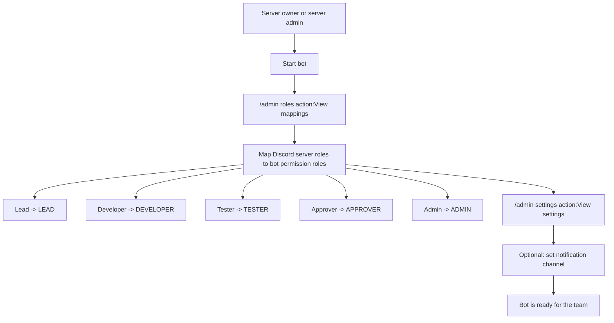
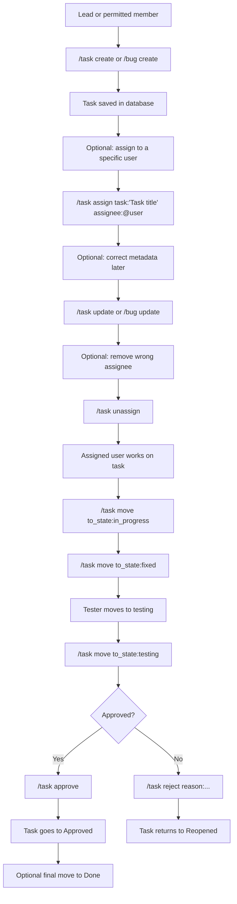
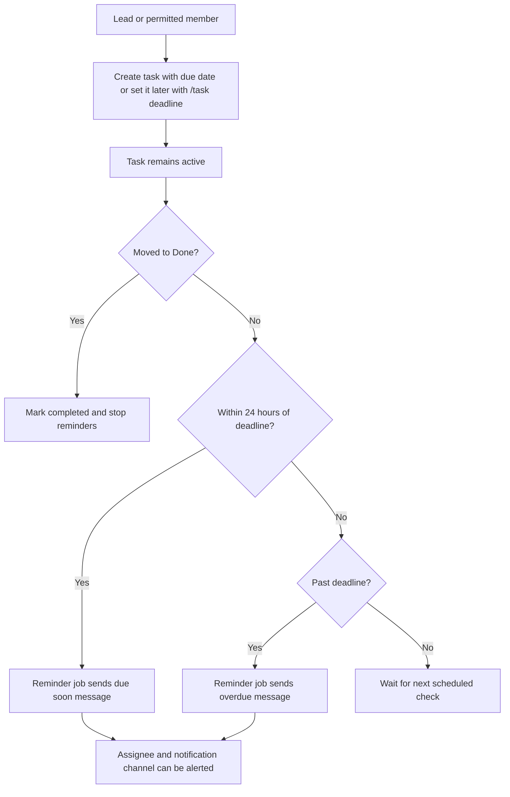
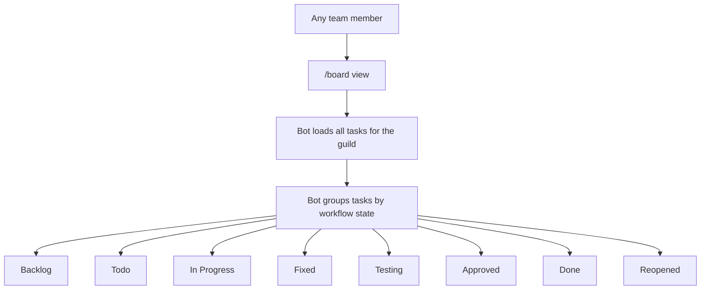
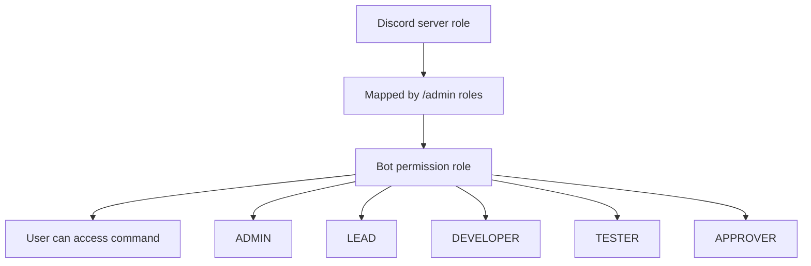

# User Flow

This document explains how server admins and team members use the bot in practice.

## Admin setup flow



## Team usage flow



## Deadline and reminder flow



## Board usage flow



## Permission model



## Practical examples

### 1. Map a role

```text
/admin roles action:Map role to permission discord_role:@Lead app_role:LEAD
```

### 2. Create a task with a deadline

```text
/task create title:"Build auth" description:"Implement login" priority:HIGH assignee:@alice due_date:2026-04-20
```

### 3. Assign a task to a user

```text
/task assign task:"Build auth" assignee:@alice
```

### 4. Fix or update a task

```text
/task update task:"Build auth" title:"Build auth v2" assignee:@bob due_date:2026-04-22
/task unassign task:"Build auth"
```

### 5. Move a task

```text
/task move task:"Build auth" to_state:in_progress
```

### 6. Archive finished or obsolete work

```text
/task archive task:"Build auth"
```

### 7. Check urgent work

```text
/task my
/task due_today
/task overdue
/board view
```
